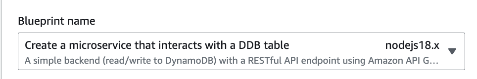

# Deploy the Lambda Functions

1. Create a new Lambda function for sendMessageAPI:
  * Click on "Create function"
  * Select "Use a blueprint" for DDB with API Gateway
   
  * Enter function name (example: messageAPI)
  * Select "Create a new role from AWS policy templates"
  * Provide role name (example: messageAPIRole)
  * Select "Create a new API"
  * Select API type as "HTTP API"
  * Select security as "open"
  * Create function
2. Copy content of index.mjs and paste it

# Create dynamodb table

1. Create a new dynamodb table as Messages
  * Setup id as primary partition